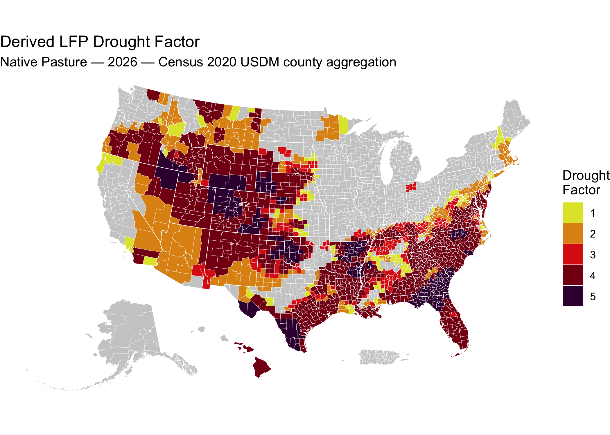

<!-- README.md is generated from README.Rmd. Please edit that file -->

[](https://github.com/sustainable-fsa/fsa-lfp-eligibility-derived/)


# FSA Livestock Forage Disaster Program Eligibility, Derived

This repository recomputes eligibility for the USDA [Livestock Forage
Disaster Program
(LFP)](https://www.fsa.usda.gov/resources/programs/livestock-forage-disaster-program-lfp)
from the US Drought Monitor and FSA’s published Normal Grazing Periods,
for program years 2008 onward, under four different conventions for
aggregating the drought monitor to counties.

The US Drought Monitor is drawn without regard to political boundaries,
so it must be cut to county shapes before the eligibility rule can be
applied. The boundary dataset used for that cut is not specified in
statute and FSA does not publish it. This archive reports what the rule
yields under each convention, so the sensitivity of eligibility to that
choice can be measured.

<a href="https://data.sustainable-fsa.com/fsa-lfp-eligibility-derived/" target="_blank">📂
View the LFP eligibility reanalysis archive listing here.</a>

> **Note**: This archive is **derived**, not a record of USDA’s
> determinations. For FSA’s own published eligibility determinations,
> see
> [sustainable-fsa/fsa-lfp-eligibility](https://sustainable-fsa.com/fsa-lfp-eligibility/).
> The two are not expected to agree everywhere, and where they differ
> this archive is not the authority.

------------------------------------------------------------------------

## 🗂️ Contents

- [`fsa-lfp-eligibility-derived.csv`](https://data.sustainable-fsa.com/fsa-lfp-eligibility-derived/fsa-lfp-eligibility-derived.csv)
  — every qualifying drought event, its date, and the drought factor it
  earns
- [`fsa-lfp-eligibility-derived.parquet`](https://data.sustainable-fsa.com/fsa-lfp-eligibility-derived/fsa-lfp-eligibility-derived.parquet)
  — the same records as Parquet
- [`usdm.parquet`](https://data.sustainable-fsa.com/fsa-lfp-eligibility-derived/usdm.parquet)
  — the weekly county USDM record this archive reads, all four
  aggregations side by side
- [`qa-report.txt`](https://data.sustainable-fsa.com/fsa-lfp-eligibility-derived/qa-report.txt)
  — validation summary, and the enumerated list of every record affected
  by the FSA-county/Census-county fan-out
- [`data/usdm/`](https://data.sustainable-fsa.com/fsa-lfp-eligibility-derived/)
  — the same weekly record as immutable per-week files
- [`fsa-lfp-eligibility-derived.R`](./fsa-lfp-eligibility-derived.R) —
  processing script
- [`_manifest.txt`](https://data.sustainable-fsa.com/fsa-lfp-eligibility-derived/_manifest.txt)
  — flat index of every file in the S3-hosted mirror

------------------------------------------------------------------------

## ☁️ Archive Hosting & Automated Publishing

The combined outputs, the QA report, and the weekly files under
`data/usdm/` are mirrored to S3 and served via CloudFront at
<https://data.sustainable-fsa.com/fsa-lfp-eligibility-derived/> (browse
the [archive
listing](https://data.sustainable-fsa.com/fsa-lfp-eligibility-derived/)
or
[`_manifest.txt`](https://data.sustainable-fsa.com/fsa-lfp-eligibility-derived/_manifest.txt)
for a flat index).

The derived records are mirrored in **both** places: the CSV and Parquet
are committed to this repository as well as published to S3, so the
archive is readable from a git checkout alone and its history is
inspectable commit by commit. The weekly USDM inputs under `data/usdm/`
and the combined `usdm.parquet` are far larger and live on S3 only.

Publishing is handled by
[`fsa-lfp-eligibility-derived.R`](./fsa-lfp-eligibility-derived.R) via
the shared [`R/s3-archive.R`](R/s3-archive.R) helpers, and runs
automatically in GitHub Actions
([`.github/workflows/fsa-lfp-eligibility-derived.yaml`](.github/workflows/fsa-lfp-eligibility-derived.yaml)).
It is dispatched each Thursday once the upstream USDM county
aggregations have published, with a cron fallback. The workflow
authenticates to AWS via GitHub OIDC (no long-lived credentials stored
in the repo), re-renders this README from the freshly updated archive,
and commits it back to git only if the rendered output changed.

The weekly build is incremental: a USDM week already present in
`data/usdm/` is never recomputed, and a week not yet published by *all
four* upstream aggregations is skipped rather than half-built.

------------------------------------------------------------------------

## 📥 Input Data

Everything is read over HTTPS from companion archives in this
organization. No FOIA workbook is read directly, and no county boundary
is recomputed here.

### USDM county aggregations

Four archives, each aggregating the same weekly USDM polygons to
counties under a different boundary convention. For every county and
week, this archive takes the **worst drought class** touching the
county, which is the standard the statute sets — 7 U.S.C. § 1531(d)(3)
triggers on drought “in any area of the county”.

| Archive | Boundary convention |
|----|----|
| [`usdm-counties-reported`](https://sustainable-fsa.com/usdm-counties-reported/) | The county statistics NDMC itself reports |
| [`usdm-counties-fsa-lfp`](https://sustainable-fsa.com/usdm-counties-fsa-lfp/) | The boundary file FSA uses for LFP |
| [`usdm-counties-census-2020`](https://sustainable-fsa.com/usdm-counties-census-2020/) | Census 2020 counties, held fixed |
| [`usdm-counties`](https://sustainable-fsa.com/usdm-counties/) | Census counties, vintage-matched to each USDM week |

### Normal Grazing Periods

[`fsa-normal-grazing-period`](https://sustainable-fsa.com/fsa-normal-grazing-period/)
— the start and end date of the normal grazing period for each program
year, FSA county, and pasture type, obtained by FOIA. This defines the
window inside which drought counts.

### FSA county definitions

[`fsa-counties-dd22`](https://sustainable-fsa.com/fsa-counties-dd22/) —
the FSA county to Census county (FIPS) crosswalk.

The dd22 vintage is used for every program year rather than
vintage-matched against dd17. It resolves every FSA county the Normal
Grazing Period archive names, where dd17 drops Shoshone County, ID
(`16079`) from 2015 on, and holding one crosswalk fixed keeps the
vintage from becoming a year-dependent confound in the comparison across
aggregations.

------------------------------------------------------------------------

## 🧹 Processing Workflow

The processing script
[`fsa-lfp-eligibility-derived.R`](./fsa-lfp-eligibility-derived.R):

1.  **Downloads** each newly published week from all four USDM county
    aggregations, takes the worst class per county, and writes one
    Parquet file per week to `data/usdm/`.
2.  **Combines** those weeks into `usdm.parquet`.
3.  **Reads the Normal Grazing Periods** and maps them from FSA counties
    onto Census counties through the dd22 crosswalk, keeping both keys
    (see *Two county keys* below).
4.  **Run-length encodes** the weekly county USDM record into runs of
    constant drought class, collapsing everything below D2 into a single
    `< D2` class since nothing below D2 can qualify.
5.  **Clips** each run to the normal grazing period. Only the portion of
    a drought spell falling *inside* the grazing window counts toward a
    tier.
6.  **Dates each qualifying drought event** under the rules in force for
    that program year, and assigns the drought factor it earns.
7.  **Keeps the escalating events.** Within each county, program year,
    and pasture type, a record is kept only when it raises the drought
    factor above everything that came before it, so the archive reads as
    the eligibility history actually accrued over the grazing season.
8.  **Validates** the result and writes a QA report.
9.  **Exports** `fsa-lfp-eligibility-derived.csv` and
    `fsa-lfp-eligibility-derived.parquet`, and publishes to S3.

## 📤 Output Data

### `fsa-lfp-eligibility-derived.csv` and `.parquet`

Identical records in both formats. One record per **Census county, FSA
county, USDM county aggregation, program year, pasture type, and
qualifying drought event**. A county with an escalating drought season
carries several records — one for each tier as it was reached.

Prefer the Parquet where you can. It carries types, so `FIPS` and
`FSA County` come back as character and `Qualifying Date` as a date. The
CSV carries none, and what you get depends on the reader:
`readr::read_csv()` infers both correctly, but base R’s `read.csv()` and
pandas read the county codes as integers and drop the leading zero,
turning Autauga County, AL (`01001`) into `1001`. Read them as character
explicitly:

``` r
readr::read_csv(
  "https://data.sustainable-fsa.com/fsa-lfp-eligibility-derived/fsa-lfp-eligibility-derived.csv",
  col_types = readr::cols(FIPS = "c", `FSA County` = "c")
)
```

| Variable | Description |
|----|----|
| `FIPS` | Census county (5-digit state + county ANSI/FIPS code) |
| `FSA County` | FSA county (5-digit FSA state + county code) |
| `source` | Which USDM county aggregation produced this record |
| `Program Year` | LFP program year |
| `Pasture Type` | Grazing land or pastureland type, as FSA classifies it |
| `Qualifying Drought Event` | The tier reached: `D2`, `D3a`, `D3b`, `D4a`, `D4b`, or for 2026 onward `D2a_2026` and `D2b_2026` |
| `Qualifying Date` | The date the tier was satisfied — the last day of the qualifying window |
| `Drought Factor` | Monthly payments the event earns |

**`Drought Factor` is not the payable amount.** It corresponds to FSA’s
`Drought Factor`, not its `Payment Factor`. FSA caps an award at the
*Maximum Eligible Payment Months* implied by the length of the grazing
period, so the payable figure is `min(Drought Factor, MEPM)`. This
archive carries neither the cap nor the capped figure, because both
follow from the grazing period alone — take the dates from
[`fsa-normal-grazing-period`](https://sustainable-fsa.com/fsa-normal-grazing-period/)
and apply whatever cap your analysis calls for.

### `usdm.parquet`

The weekly county USDM record this archive reads. One row per Census
county and USDM week, with one column per aggregation carrying that
week’s worst drought class in that county.

| Variable | Description |
|----|----|
| `FIPS` | Census county (5-digit state + county ANSI/FIPS code) |
| `usdm_date` | USDM map date (the Tuesday the map takes effect) |
| `usdm-counties` | Worst class that week, vintage-matched Census aggregation |
| `usdm-counties-census-2020` | Worst class that week, Census 2020 aggregation |
| `usdm-counties-fsa-lfp` | Worst class that week, FSA LFP boundary aggregation |
| `usdm-counties-reported` | Worst class that week, NDMC-reported aggregation |

Drought classes are ordered factors: `None` \< `D0` \< `D1` \< `D2` \<
`D3` \< `D4`.

------------------------------------------------------------------------

## 🌵 Drought tiers and payment ladders

LFP pays for grazing losses when the US Drought Monitor rates a county
at a qualifying intensity during the normal grazing period for that
pasture type. The tiers, and the monthly payments they earn, have
changed twice.

**2008 Farm Bill — program years 2008–2011**

| Monthly payments | Qualifying drought event                   |
|------------------|--------------------------------------------|
| 1                | D2 for at least 8 consecutive weeks        |
| 2                | D3 at any time                             |
| 3                | D3 for at least 4 weeks, or D4 at any time |

**2014 Farm Bill — program years 2012–2025**

| Monthly payments | Qualifying drought event                   |
|------------------|--------------------------------------------|
| 1                | D2 for at least 8 consecutive weeks        |
| 3                | D3 at any time                             |
| 4                | D3 for at least 4 weeks, or D4 at any time |
| 5                | D4 for at least 4 weeks                    |

**P.L. 119-21 — program years 2026 onward**

| Monthly payments | Qualifying drought event                              |
|------------------|-------------------------------------------------------|
| 1                | D2 for at least 4 consecutive weeks                   |
| 2                | D2 for at least 7 of the previous 8 consecutive weeks |
| 3                | D3 at any time                                        |
| 4                | D3 for at least 4 weeks, or D4 at any time            |
| 5                | D4 for at least 4 weeks                               |

Section 10401(b) of P.L. 119-21 (July 4, 2025) split the D2 tier,
amending 7 U.S.C. 9081(c)(3)(D)(ii)(I). The 4-week and
4-consecutive-week distinctions are as written: the D2 tiers require
consecutive weeks, the D3 and D4 4-week tiers do not.

The event codes used across these archives are `D2`, `D3a`, `D3b`, `D4a`
and `D4b`, and from 2026 `D2a_2026` and `D2b_2026` in place of `D2`. The
`a` tiers trigger at any time; the `b` tiers require a duration.

### Which date qualifies a tier

`D2`, `D2A`, `D2B`, `D3B` and `D4B` require a duration, and are
satisfied on the last day of the qualifying window — their `END`. `D3A`
and `D4A` trigger at any time, carry no `END` value, and are satisfied
on their `START`.

| Event      | Source column    |
|------------|------------------|
| `D2`       | `D2 END`         |
| `D2a_2026` | `D2A END`        |
| `D2b_2026` | `D2B END`        |
| `D3a`      | `D3A START DATE` |
| `D3b`      | `D3B END`        |
| `D4a`      | `D4A START DATE` |
| `D4b`      | `D4B END`        |

FSA reports each B-tier `START` as a copy of its A-tier counterpart, so
a START-keyed reshape of the wide table double-counts D3 and D4.

Both conventions are applied consistently across every tier.

### ✅ Validation

The script enforces five invariants and aborts before writing anything
if any of them fails, so a defect cannot reach the published archive:

- exactly one grazing period per program year, Census county, FSA
  county, and pasture type;
- every FSA county resolves against FSA’s published county definitions;
- no missing values in any published field;
- every drought factor within the ladder in force for its program year;
- every qualifying date inside its normal grazing period.

The FSA-county/Census-county fan-out is *reported* rather than treated
as fatal, since it is a property of FSA’s administrative geography
rather than a defect. See
[`qa-report.txt`](https://data.sustainable-fsa.com/fsa-lfp-eligibility-derived/qa-report.txt)
for the enumerated records.

------------------------------------------------------------------------

## 🗺️ Two county keys

An LFP determination needs two counties. The normal grazing period is
set per **FSA county** — the administrative unit, established through
NAP and the National Crop Table (1-LFP Amend. 7, par. 27). Eligibility
then triggers on drought “in any area of the county” as a **Census
county**, the unit the US Drought Monitor is aggregated to (par. 23).

The two do not nest, in either direction. One FSA county may cover
several Census counties, most widely in Puerto Rico and Alaska, and in
the Virginia county-plus-independent-city pairs. Several FSA counties
may fall inside one Census county, where FSA splits a county
administratively and each office sets its own grazing period: Aroostook
ME, Custer ID, Pottawattamie IA, Otter Tail MN, Polk MN, St. Louis MN,
Nye NV, Lucas OH and Galax VA.

Records are therefore keyed on both counties and never combined.
Reducing to a single county grain is the consumer’s choice;
`qa-report.txt` lists the records it affects. The FSA-to-Census
crosswalk is published in
[fsa-counties-dd17](https://sustainable-fsa.com/fsa-counties-dd17/) and
[fsa-counties-dd22](https://sustainable-fsa.com/fsa-counties-dd22/).

### Choosing a rule

Three defensible rules, none of them a default:

- **Keep both keys.** Correct if you are studying the program as
  administered. Nothing to decide, but your unit of analysis is a county
  *pair*, not a county.
- **Take the highest drought factor.** Simple and reproducible, and it
  matches the direction FSA’s own determinations lean. It will overstate
  eligibility wherever one constituent county was drier than the office
  as a whole.
- **Take the principal county** — the Census county whose FIPS code
  equals the FSA county code. Defensible where the FSA office is named
  for one dominant county, but not universal: it fails where the office
  is not named for any of the counties it covers, including Fairbanks
  AK, Palmer AK, Dade FL (`12025`, a FIPS code retired in 1997) and
  Mayaguez PR.

The choice affects a minority of determinations, but by up to three
monthly payments. Nye County, NV (`32023`) is the widest case: for
Native Pasture in 2012, under all four aggregations, Northwest Nye earns
four monthly payments where Southeast Nye earns one, from grazing
periods the two offices set differently over the same drought.
[`qa-report.txt`](https://data.sustainable-fsa.com/fsa-lfp-eligibility-derived/qa-report.txt)
lists every affected record.

``` r
# Reducing to FSA county grain by taking the highest drought factor. `max()`
# here is the decision — state it explicitly rather than letting a distinct()
# or an arrange() pick silently.
lfp |>
  dplyr::group_by(source, `Program Year`, `FSA County`, `Pasture Type`) |>
  dplyr::summarise(`Drought Factor` = max(`Drought Factor`), .groups = "drop")
```

------------------------------------------------------------------------

## 📍 Quick Start: Map LFP Eligibility in R

This README is rendered by the weekly build, so the example reads the
Parquet file that build just produced. To run it yourself, substitute
the published URL
<https://data.sustainable-fsa.com/fsa-lfp-eligibility-derived/fsa-lfp-eligibility-derived.parquet>
— `arrow::read_parquet()` takes it directly.

``` r
# Load required libraries
library(sf)
library(ggplot2) # For plotting
library(tigris)  # For county boundaries
library(rmapshaper) # For innerlines function

## Get the derived eligibility data
lfp <- arrow::read_parquet("fsa-lfp-eligibility-derived.parquet")

counties <-
  tigris::counties(cb = TRUE,
                   resolution = "5m",
                   progress_bar = FALSE) |>
  dplyr::filter(
    !(STATE_NAME %in% c("Guam",
                        "American Samoa",
                        "United States Virgin Islands",
                        "Commonwealth of the Northern Mariana Islands"))
  ) |>
  sf::st_cast("POLYGON", warn = FALSE, do_split = TRUE) |>
  tigris::shift_geometry() |>
  dplyr::group_by(STATEFP, COUNTYFP) |>
  dplyr::summarise(.groups = "drop") |>
  sf::st_cast("MULTIPOLYGON")

## The 2026 Native Pasture drought factor on Census 2020 boundaries, reduced to
## Census county grain by taking the highest factor across the FSA offices that
## share a county. That `max()` is one of the reduction rules described above.
lfp_counties <-
  lfp |>
  dplyr::filter(`Pasture Type` == "Native Pasture",
                `Program Year` == 2026,
                source == "usdm-counties-census-2020") |>
  dplyr::group_by(id = FIPS) |>
  dplyr::summarise(`Drought Factor` = max(`Drought Factor`),
                   .groups = "drop") |>
  dplyr::mutate(
    `Drought Factor` = factor(`Drought Factor`,
                              levels = 1:5,
                              ordered = TRUE)
  ) |>
  dplyr::left_join(
    counties |>
      dplyr::transmute(id = paste0(STATEFP, COUNTYFP))
    ) |>
  sf::st_as_sf()

# Plot the map
ggplot(counties) +
  geom_sf(data = sf::st_union(counties),
          fill = "grey80",
          color = NA) +
  geom_sf(data = lfp_counties,
          aes(fill = `Drought Factor`),
          color = NA,
          show.legend = TRUE) +
  geom_sf(data = rmapshaper::ms_innerlines(counties),
          fill = NA,
          color = "white",
          linewidth = 0.1) +
  geom_sf(data = counties |>
            dplyr::group_by(STATEFP) |>
            dplyr::summarise() |>
            rmapshaper::ms_innerlines(),
          fill = NA,
          color = "white",
          linewidth = 0.2) +
  # Use the same color scale used by the LFP
  # https://www.fsa.usda.gov/documents/native-pasture-2024-lfp-01-23-25
  scale_fill_manual(
    values = c("1" = "#E0E436",
               "2" = "#DF9114",
               "3" = "#DD2313",
               "4" = "#850014",
               "5" = "#3B003C"),
    drop = FALSE,
    name = "Drought\nFactor") +
  labs(title = "Derived LFP Drought Factor",
       subtitle = "Native Pasture — 2026 — Census 2020 USDM county aggregation") +
  theme_void()
```



------------------------------------------------------------------------

## 🧭 Related archives

Three archives cover LFP county eligibility, at the same event grain and
with the same event codes, so they can be compared directly:

- [fsa-lfp-eligibility](https://sustainable-fsa.com/fsa-lfp-eligibility/)
  — FSA’s determinations as obtained by FOIA, program years 2008–2025
- [fsa-lfp-eligibility-web](https://sustainable-fsa.com/fsa-lfp-eligibility-web/)
  — FSA’s determinations as published weekly on its maps page,
  2008–present, including every superseded weekly version
- [fsa-lfp-eligibility-derived](https://data.sustainable-fsa.com/fsa-lfp-eligibility-derived/)
  — eligibility recomputed from the US Drought Monitor under four county
  aggregations

The FOIA archive is the richer record for closed program years: it
includes fire eligibility and payment factors the web tables omit. The
web archive covers the current program year and, for 2008–2011, carries
per-tier dates the FOIA response omitted. The derived archive is not a
record of FSA’s determinations.

------------------------------------------------------------------------

## 📝 Citation

If you use this data in published work, please cite:

> Bocinsky, R. Kyle. *Livestock Forage Disaster Program Eligibility,
> 2008–present: Eligibility Derived across Authoritative County Boundary
> Datasets*. Montana Climate Office, University of Montana. Sustainable
> FSA project. Accessed YYYY-MM-DD.
> <https://data.sustainable-fsa.com/fsa-lfp-eligibility-derived/>

Machine-readable metadata are in [`CITATION.cff`](CITATION.cff);
GitHub’s **Cite this repository** button (top right of the repo page)
renders it as APA or BibTeX.

The underlying data this archive reads should be cited separately — the
Normal Grazing Periods and the USDM county aggregations each have their
own archive and citation.

**Acknowledgment**: This work is part of the [*Enhancing Sustainable
Disaster Relief in FSA
Programs*](https://www.ars.usda.gov/research/project/?accnNo=444612)
project, supported by the USDA Office of the Chief Economist, Office of
Energy and Environmental Policy, and the USDA Climate Hubs.

## 📄 License

- **Raw USDM data** (NDMC) and **raw FOIA data** (USDA): Public Domain
  (17 USC § 105)
- **Processed data & scripts**: © R. Kyle Bocinsky, released under
  [CC0](https://creativecommons.org/publicdomain/zero/1.0/) and [MIT
  License](./LICENSE) as applicable

------------------------------------------------------------------------

## ⚠️ Disclaimer

This dataset is archived for research and educational use only. It is a
derived, not a record of USDA’s determinations, and it is not evidence
of any producer’s eligibility for any program. It may not reflect
current USDA administrative boundaries or official LFP policy. Always
consult your **local FSA office** for the latest program guidance.

To locate your nearest USDA Farm Service Agency office, use the USDA
Service Center Locator:

🔗 [**USDA Service Center
Locator**](https://offices.sc.egov.usda.gov/locator/app)

------------------------------------------------------------------------

## 👏 Acknowledgment

This project is part of:

**[*Enhancing Sustainable Disaster Relief in FSA
Programs*](https://www.ars.usda.gov/research/project/?accnNo=444612)**\
Supported by USDA OCE/OEEP and USDA Climate Hubs\
Prepared by the [Montana Climate Office](https://climate.umt.edu)

------------------------------------------------------------------------

## ✉️ Contact

**R. Kyle Bocinsky**\
Director of Climate Extension\
Montana Climate Office\
📧 <kyle.bocinsky@umontana.edu>\
🌐 <https://climate.umt.edu>
